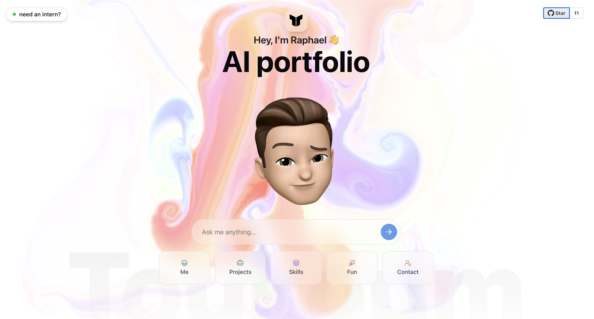

# AI-driven Portfolio

A conversational portfolio that responds to questions about projects, skills, and background. Built with Next.js and an AI chat layer so visitors can ask about your work instead of scrolling.

## Key features
- Interactive AI avatar that answers questions
- Quick-access questions (Projects, Skills, Contact, Fun)
- GitHub integration (stars / projects)
- Easy to run locally for development

## Quick start (local)
Prerequisites:
- Node.js v18+
- Either `pnpm` or `npm`
- OpenAI API key (for chat features)
- Optional: GitHub token (for GitHub integrations)

1. Clone

```bash
git clone <your-repo-url>
cd portfolio
```

2. Install dependencies (choose one)

```bash
pnpm install
# or
npm install
```

3. Environment

Create a `.env.local` file in the `portfolio` folder with the following keys:

```
OPENAI_API_KEY=sk-...
GITHUB_TOKEN=ghp_...
# Optional: PORT=3001
```

4. Run dev server

```bash
pnpm dev
# or
npm run dev
```

Open http://localhost:3000 (or the value in `PORT`) in your browser.

## Build for production

```bash
pnpm build
pnpm start
# or
npm run build
npm run start
```

## Configuration
- AI behavior and chat tools live under `src/app/api/chat/tools`.
- Rate-limiting and local tracking logic is in `src/lib/fastfolio-tracking.ts`.

## Troubleshooting
- If you see validation errors from tools, ensure environment variables are set and restart the dev server.
- Missing media (e.g. `final_memojis.webm`) may be due to absent files in `/public` — check `public/`.

## Contributing
- Open an issue or PR with a clear description.
- For quick UI changes, edit components under `src/components` and run the dev server.

## Contact
- Visit the live site for the interactive experience: https://toukoum.fr

---

If you'd like, I can also:
- Add a short development checklist (build+test commands)
- Add a production-ready `.env.example`

